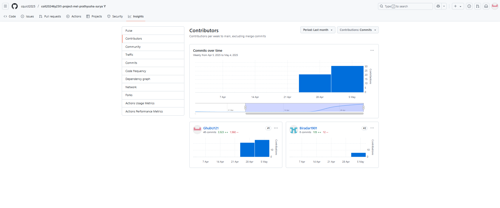

# Project Reflection
This section reflects on the success and challenges in the project and with teamwork.

[GitHub Commits](#github-commits) | [List of Tasks](#list-of-tasks) | [Reflection on Commits and Tasks](#reflection-on-commits-and-tasks) | [Reflection on Group Work](#reflection-on-group-work) | [Plan](./plan.md) | [Network Design](./network.md) | [Cloud Services](./cloud.md) | [Security](./security.md) | [Ethics](./ethics.md) | [Return to index](./README.md)

## GitHub Commits
The following is the screenshot of Github Committs

GhubU121 refers to Surya Velisetti (Not reflecting even when the name is updated)
 

## List of Tasks

Task 4.1.1 - List the Assumptions: = Surya Contribution - 50 %; Prathysha Contribution - 50 % 

Task 4.1.2 - Design the Network: = Surya Contribution - 80 %; Prathysha Contribution - 20 %

Task 4.1.3 - Design the Network: = Surya Contribution - 80 %; Prathysha Contribution - 20 % 

Task 4.2.1 - Cloud Servers: = Surya Contribution - 50 %; Prathysha Contribution - 50 %  

Task 4.3.1 - Cyber Security risk assessment: = Surya Contribution - 20 %; Prathysha Contribution - 80 %

Task 4.3.2 - Recommend security controls : = Surya Contribution - 20 %; Prathysha Contribution - 80 % 

Task 4.4 - Etheical and Social Issues : = Surya Contribution - 50 %; Prathysha Contribution - 50 % 

Task 5.1 - Evaluate Cloud Implementation: Surya Contribution - 50 %, Prathyusha Contribution - 50 %

Task 5.2 - Review Performance Metrics: Surya Contribution - 50 %, Prathyusha Contribution - 50 %

Task 5.3 - Identify Optimization Strategies: Surya Contribution - 50 %, Prathyusha Contribution - 50 %

Task 5.4 - Final Review and Recommendations

## Reflection on Commits and Tasks
Surya made 46 commits, contributing primarilr to branch office networks,core network design for network and security recommendations.
Prathyusha has 6 commits, focused on WIFI justification, ethical issues, cloud, security and project documentations.

## Reflection on Group Work
Progress was slowed due to difficulties in aligning schedules.
 •	Team members had varying skill levels, which required extra time to learn new tools or tasks.

Suggestions to Improve Future Collaboration:
 •	To keep everyone on the same page, holding short daily meetings helps track progress and fix issues early. This boosts team accountability and efficiency.
 •	Using tools to automatically track tasks helps avoid missing important work and flags delays early, keeping the team organized and deadline-aware.
 •	Setting up a clear Git branching plan lets members work separately without disrupting each other’s changes. It keeps version control smooth and avoids merge problems.
 •	Cloud-based tools for documentation ensure everyone can see the latest updates anytime, reducing confusion and helping the team work better together
